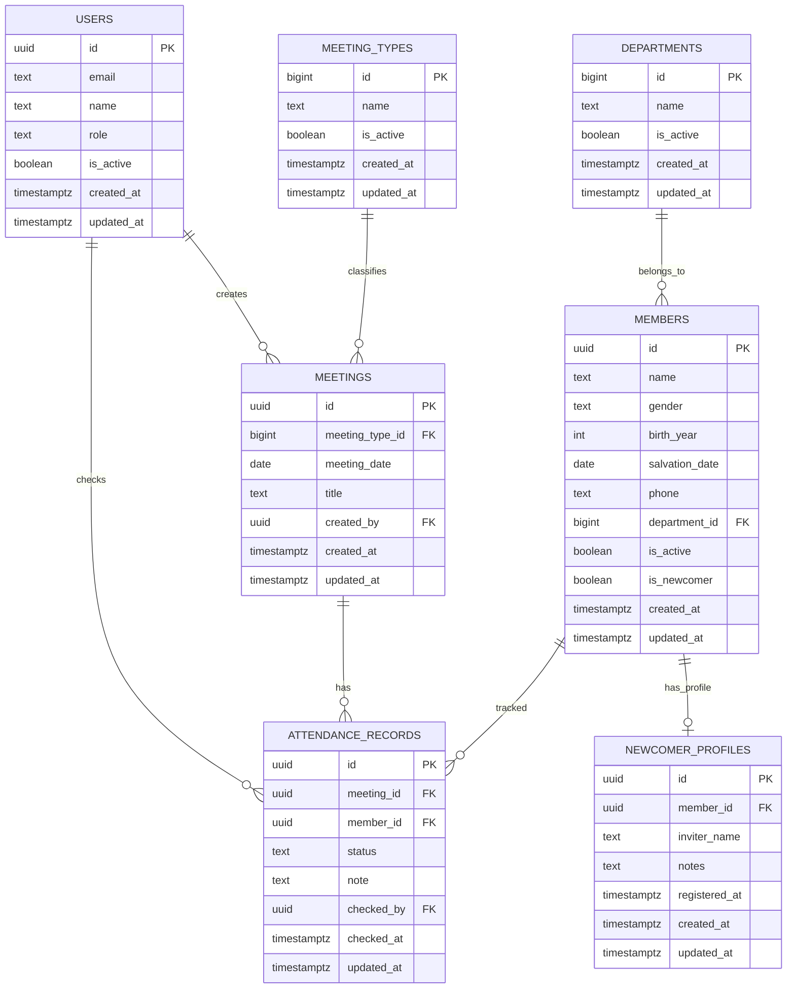

# ERD 설명

## 핵심 설계 원칙

- 인증은 Supabase Auth(`auth.users`)를 사용하고, 앱 권한 정보는 `public.users`로 분리합니다.
- 개인정보(이름, 연락처)를 포함할 수 있으므로 RLS를 전제로 설계합니다.
- 삭제는 soft delete 대신 `is_active` 중심으로 운영합니다.
- 출석 데이터 무결성을 위해 `attendance_records (meeting_id, member_id)` 유니크를 강제합니다.

## 테이블 관계 요약

- `users` 1 : N `meetings` (`created_by`)
- `users` 1 : N `attendance_records` (`checked_by`)
- `departments` 1 : N `members`
- `members` 1 : 0..1 `newcomer_profiles`
- `meeting_types` 1 : N `meetings`
- `meetings` 1 : N `attendance_records`
- `members` 1 : N `attendance_records`

## Mermaid ERD 코드

